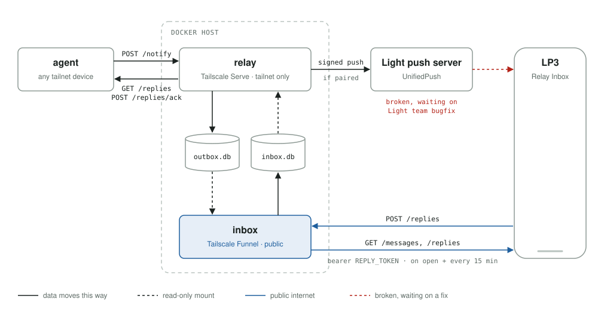

# light-relay

A small server that passes short messages from an agent (a script, a cron job, or an LLM
agent) to the [Relay Inbox](https://github.com/wsturgiss/light-relay-inbox) tool on a
Light Phone III, and passes the replies back.



It runs as two containers from one image:

- **relay** is reachable only from the tailnet, through Tailscale Serve. Agents on devices
  listed in `ALLOWED_PEERS` send messages to it and collect replies from it.
- **inbox** is public, through Tailscale Funnel, and requires the reply token. The phone
  fetches messages from it and posts replies to it.

Each container reads the other's database through a read-only mount. The agent and the
phone make every request. The relay's only outbound call is the push to the phone.

> **Status:** push delivery to the tool doesn't work until Light fixes a LightOS bug. The
> phone fetches new messages instead, every 15 minutes and whenever the tool is opened.
> Once push works, the inbox can shrink to accepting replies only. It stays public,
> because the phone isn't on the tailnet and needs somewhere to send replies.

The code uses the Python standard library only. Run the tests with `python -m unittest`.

## Run it

You need Docker and Tailscale on the host, and
[Funnel enabled](https://tailscale.com/kb/1223/funnel) for that node in your tailnet policy.
The inbox's address will be `https://<host>.<tailnet>.ts.net:8443/replies`.

1. **Pair the phone.** Build the tool with the inbox's address as `relay.inboxUrl`, then
   open **Pairing** and copy `PUSH_KEY`, `REPLY_TOKEN` and, if LightOS issued one,
   `PUSH_ENDPOINT`. The tool's README covers both steps.

2. **Write the settings**, with the tailnet IPs allowed to call the relay
   (`tailscale ip -4 <device>`) and the values from the phone:

   ```bash
   STATE=~/.local/share/light-relay
   mkdir -p $STATE/relay $STATE/inbox
   printf 'ALLOWED_PEERS=100.64.0.7,100.64.0.8\nPUSH_KEY=…\nPUSH_ENDPOINT=…\n' > $STATE/relay.env
   printf 'REPLY_TOKEN=…\n' > $STATE/inbox.env
   chmod 600 $STATE/*.env
   ```

3. **Build and start** both containers on `127.0.0.1`, the relay on port 18080 and the
   inbox on 18081:

   ```bash
   docker build -t light-relay .
   docker run -d --name light-relay-inbox --restart unless-stopped --network host \
     --user "$(id -u):$(id -g)" --env-file $STATE/inbox.env \
     -e ROLE=inbox -e HOST=127.0.0.1 -e PORT=18081 \
     -v $STATE/inbox:/data -v $STATE/relay:/outbox:ro light-relay
   docker run -d --name light-relay --restart unless-stopped --network host \
     --user "$(id -u):$(id -g)" --env-file $STATE/relay.env \
     -e ROLE=relay -e HOST=127.0.0.1 -e PORT=18080 \
     -v $STATE/relay:/data -v $STATE/inbox:/inbox:ro light-relay
   ```

4. **Publish** the relay to the tailnet and the inbox to the internet:

   ```bash
   tailscale serve  --bg --https=443  http://127.0.0.1:18080
   tailscale funnel --bg --https=8443 http://127.0.0.1:18081
   ```

5. **Test it** from an allowed device:

   ```bash
   curl https://<host>.<tailnet>.ts.net/healthz    # {"ok": true, "paired": true, ...}
   ```

Docker reads an `.env` file only when it creates a container. To apply a change, remove the
container with `docker rm -f` and run it again. `scripts/up.sh [state dir] [allowed IPs]`
does steps 2 to 4 in one go and is safe to re-run. On the first run it writes a stand-in
`REPLY_TOKEN` for you to replace.

**On Unraid:**

- Put the state in `/mnt/user/appdata/light-relay`.
- Leave out `--user`. The image already runs as `nobody:users` (99:100), Unraid's appdata
  owner, so `chown 99:100` the `relay` and `inbox` directories instead.
- Tailscale must be installed on the Unraid host itself for step 4.
- `scripts/deploy-unraid.sh root@<host> [allowed IPs]` copies the source over SSH and runs
  `up.sh` there.

## Connect an agent

The agent needs a device on the tailnet. It holds no secrets: the relay identifies it by
its tailnet IP.

1. Add the device's IP to `ALLOWED_PEERS` in `relay.env`, then recreate the relay container.
2. Copy [`agent/relayctl.py`](agent/relayctl.py) to the device. It needs only Python 3.
3. Send a message, and check for replies on a schedule:

   ```bash
   export RELAY_URL=https://<host>.<tailnet>.ts.net
   relayctl.py notify "Book the 9:40?" "Holds expire at noon." --choice Yes --choice No
   # {"id": "m_691c2570d10b8b8a", "at": "…", "thread": "m_691c2570d10b8b8a", "pushed": true}
   relayctl.py replies       # unacknowledged replies, as JSON
   relayctl.py ack <seq>     # after acting on them
   ```

- **Answer a reply in its conversation** with `--thread <its messageId>`. Without
  `--thread`, the message starts a new conversation on the phone.
- **Acknowledge only what you've acted on.** Unacknowledged replies come back on the next
  check, so a crash can't lose one.
- **Don't resend when `pushed` is `false`.** The message is stored, and the phone fetches it
  within 15 minutes. A resend appears twice.
- **Keep it short:** a headline of up to 120 characters, and a detail of two or three plain
  sentences.

If `/healthz` works but `notify` gets `403`, the device isn't in `ALLOWED_PEERS`. The relay
logs `refused POST /notify from <ip>` with the address it saw.

For an LLM agent, copy [`agent/README.md`](agent/README.md) alongside `relayctl.py` and point
the agent at it. It covers the commands, conversations, message style and errors.

Without Python, make the calls with `curl`. [`docs/protocol.md`](docs/protocol.md) describes
every route.

## Settings

Settings go in `relay.env` and `inbox.env` in the state directory.

| Variable | Container | Default | |
|---|---|---|---|
| `ALLOWED_PEERS` | relay | *(required)* | Tailnet IPs that may call the relay, comma-separated |
| `PUSH_KEY` | relay | | From the tool's Pairing screen. `/notify` answers `503` until it's set. |
| `PUSH_ENDPOINT` | relay | | From the Pairing screen. Without it, the phone fetches messages instead of receiving pushes. |
| `NOTIFY_RATE_PER_HOUR` | relay | `60` | Caps a runaway agent |
| `PUSH_TIMEOUT` | relay | `15` | Seconds |
| `RELAY_MAX_BODY` | relay | `8192` | Bytes |
| `REPLY_TOKEN` | inbox | *(required)* | From the Pairing screen. The first run writes a temporary one. |
| `INBOX_RATE_PER_MIN` | inbox | `20` | Per client IP, rejected requests included |
| `INBOX_RATE_TOTAL_PER_MIN` | inbox | `120` | Across all clients |
| `INBOX_MAX_BODY` | inbox | `4096` | Bytes |
| `TRUSTED_PROXIES` | both | `127.0.0.1,::1` | Peers whose `CLIENT_IP_HEADER` is believed |
| `CLIENT_IP_HEADER` | both | `X-Forwarded-For` | |
| `LOG_LEVEL` | both | `INFO` | |

The `docker run` commands set `ROLE`, `HOST` and `PORT`. The database paths follow the mounts.

## Security

**How the relay knows the agent.** Tailscale Serve and Funnel reach the containers as a
reverse proxy on loopback, and pass the sender's address in `X-Forwarded-For`. The relay
believes that header only from `TRUSTED_PROXIES`, and checks the address it gives against
`ALLOWED_PEERS`. For a tighter limit, add a tailnet access rule that lets only the agent and
your own devices reach the relay's node.

**What each secret allows:**

- **Push endpoint only:** nothing. The tool drops any message without a valid signature.
- **Reply token:** an attacker can show the agent fake replies and read the last 90 days of
  the conversation. They can't put a message on the phone, because that takes the push key,
  which the inbox never has.
- **No token:** the inbox answers `401` before reading the body, and rate limits cap the
  load. Funnel has no DDoS protection.

**On one host,** these commands run both containers on the host network. The inbox cannot reach the
relay through its own code, but the network doesn't stop it: if the inbox process were
compromised, it could call the relay on loopback with a forged header.

**Kill switches:**

- Remove the agent's device from the tailnet: nothing new reaches the relay.
- `docker stop light-relay`: no pushes, and no replies handed out.
- `docker stop light-relay-inbox`, or `tailscale funnel --https=8443 off`: the public
  surface is gone.
- Tap **New keys** in the tool, then put the new values in the `.env` files and recreate
  both containers. The old push key and reply token stop working. The relay re-signs its stored
  messages with the new key, so the tool keeps its history.

## Roadmap

- End-to-end encryption, so the relay carries only data it can't read.
